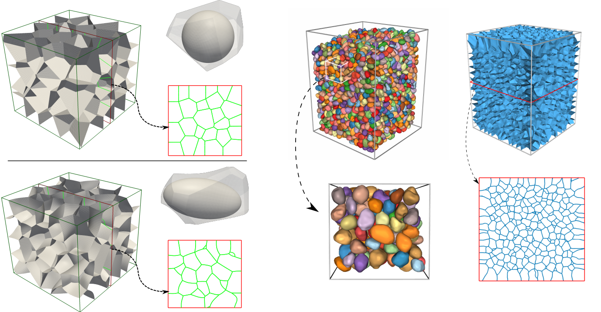

# CellFactory
A Python interface for Set Voronoi Tessellation (PySetVoronoi) of poly-superellipsoids and general point clouds from irregular particles.

Shiwei Zhao (swzhao (at) scut.edu.cn)
South China University of Technology

Copyright 2016-2021 Shiwei Zhao

## License

PySetVoronoi is free software: you can redistribute it and/or modify
it under the terms of the GNU General Public License as published by
the Free Software Foundation, either version 3 of the License, or
(at your option) any later version.

PySetVoronoi is distributed in the hope that it will be useful,
but WITHOUT ANY WARRANTY; without even the implied warranty of
MERCHANTABILITY or FITNESS FOR A PARTICULAR PURPOSE.  See the
GNU General Public License for more details.

You should have received a copy of the GNU General Public License
along with Pomelo.  If not, see <http://www.gnu.org/licenses/>.

## Compile & Install

Your compiler should support the C++17 standard.

You can create a fresh folder like 'build' at the root folder of the source
 code, and then compile the code according to the following brief instructions.

cd PySetVoronoi/

mkdir build

cd build

cmake ../src

make

make install

Note: By default, 'make install' will install the compiled libraries into the folder named 
"install" next to 'build'.

Then, you can run the examples in your terminal, e.g.,
python3 testsp.py

## Cite this work

If you plan to publish your research work using this code, please consider citing one of the following publications:

- Zhang, C., Zhao, S., Zhao, J., Zhou, X., 2021. **Three-dimensional Voronoi analysis of realistic grain packing: An XCT assisted set Voronoi tessellation framework**. _Powder Technology_ 379, 251–264. https://doi.org/10.1016/j.powtec.2020.10.054

- Zhao, S., Zhao, J., Guo, N., 2020. **Universality of internal structure characteristics in granular media under shear**. _Phys. Rev. E_ 101, 012906. https://doi.org/10.1103/PhysRevE.101.012906

- Zhao, S., Evans, T.M., Zhou, X., 2018. **Three-dimensional Voronoi analysis of monodisperse ellipsoids during triaxial shear**. _Powder Technology_ 323, 323–336. https://doi.org/10.1016/j.powtec.2017.10.023
